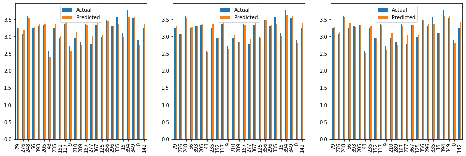
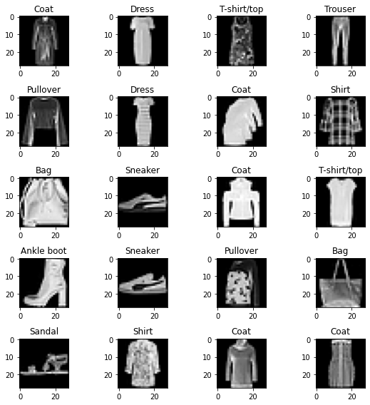

# Machine Learning Projects
This repository contains my first Machine Learning Projects, the base taken from [@quangnhat185](https://github.com/quangnhat185) 's [Machine_learning_projects](https://github.com/quangnhat185/Machine_learning_projects). 

## Contents
|Title|Type |
|---  |:---:|
|[Cats and dogs](#dog-and-cat-classification-project)|classification|
|[Fuel Efficiency](#fuel-efficiency-prediction-project)|regression|
|[Fashion clothing](#fashion-classification-on-the-fashion_mnist-dataset)|classification|
|[Coming Soon](#coming-soon)|Generators, Recommenders|

## [**Dog and Cat classification project**](https://github.com/mtc-20/Machine_learning_projects/tree/MTC/Dog_Cat_classification)  
  - Dataset: http://bit.ly/30k1jgs contains 25,000 images of dog and cat collected from the internet and sorted into corresponding folders. 
  - Model: This categorical classification model consists of 3 convolution layers, generating 9,563,970 parameters, and has an accuracy of 86.64%. 
   The image belows shows a sample classification peformed by the model, an error of 3/25 (~12%).

  

 

## [**Fuel Efficiency prediction project**](https://github.com/mtc-20/Machine_learning_projects/tree/MTC/Fuel_efficiency_prediction)
- Dataset: [Here](https://github.com/mtc-20/Machine_learning_projects/blob/MTC/Fuel_efficiency_prediction/auto-mpg.csv)
- Model: This [file](https://github.com/mtc-20/Machine_learning_projects/blob/MTC/Fuel_efficiency_prediction/FE_prediction.ipynb) contains Linear Regression, Support Vector Regression and Gradient Boosting Regression models, all of them with test scores of +85%. 

  

## [Fashion classification on the fashion_mnist dataset](Fashion_classification/Fashion_classification.ipynb)
- Dataset: Fashion_MNIST consisting of 10 different classes
- Model: 
  - A [simple CNN](Fashion_classification/fashion_mnist) (on TF2.x) trained for 10 epochs with a test accuracy of 90%. 
    

      
    

  - SGAN model : **Coming soon**

## Coming Soon
 - **House Pricing prediction project** : Based on the Boston House price dataset, while this doesn't exactly cover anything radically new, it has some nice data visualizations.
 - **GANs** : GAN trained on the fashion mnist dataset and a SGAN for classification
 - **Recommender systems** : A content based movie recommender system
